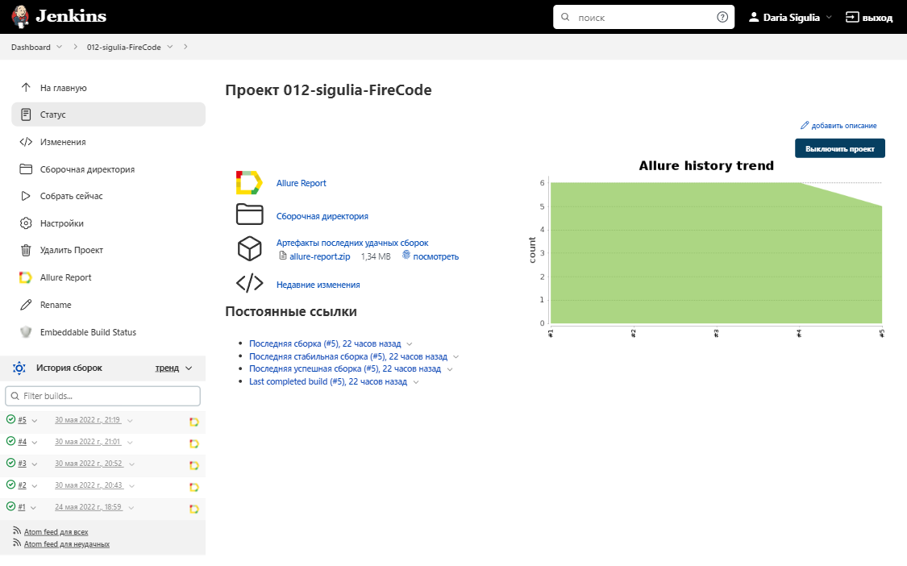
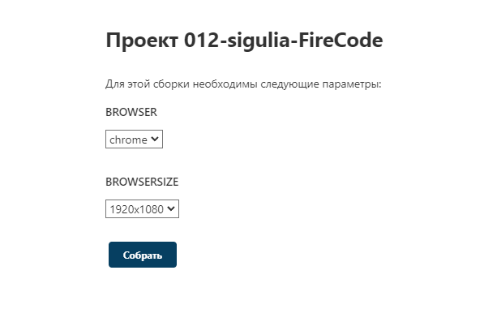
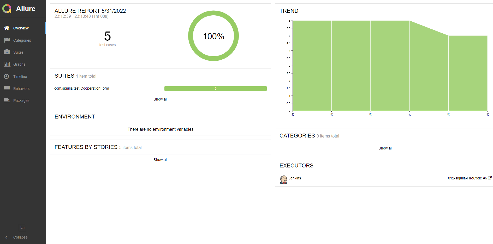
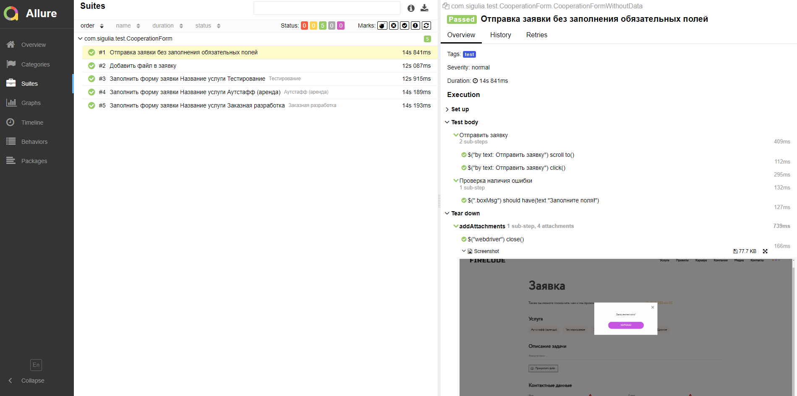
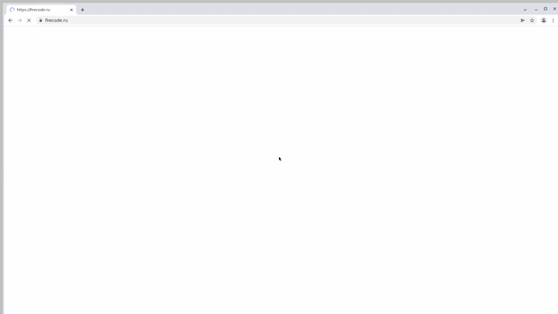
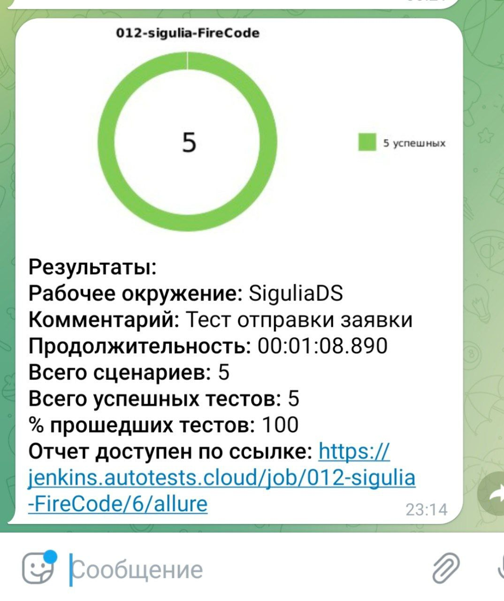

# Проект по автоматизации тестирования для 

### 👉 [Вебсайт](https://firecode.ru/)

### 🔥 Содержание:
- [x] [Технологии и инструменты](#-технологии-и-инструменты)
- [x] [Реализованные проверки](#-реализованные-проверки)
- [x] [Сборка в Jenkins](#-сборка-в-jenkins)
- [x] [Параметры сборки в Jenkins](#-параметры-сборки-в-jenkins)
- [x] [Запуск из терминала](#-запуск-из-терминала)
- [x] [Allure отчет](#-allure-отчет)
- [x] [Видео примеры прохождения тестов](#-видео-примеры-прохождения-тестов)
- [x] [Уведомления в Telegram](#-уведомления-в-telegram)

***
### 🔥 Технологии и инструменты

  
  
  
  
  
  
  
  
  
  

***
### 🔥 Реализованные проверки:

- Прикрепить файл в заявку на сотрудничество
- Попытка отправить заявку без заполения обязательный полей
- Параметризированные тесты для отправки заявки на рзные услуги:
  - Тестирование
  - Аутстафф (аренда)
  - Заказная разработка
  
(В тестах закомментирован код отправки заявки, чтоб не грузить сайт лишними данными, но он есть)

***
### 🔥 Сборка в Jenkins

***
### 🔥 Параметры сборки в Jenkins:

- BROWSER
  - chrome
  - firefox
  
- BROWSERSIZE
  - 1920x1080
  - 1024x768

***
### 🔥 Параметры сборки можно указать при запуске проекта:

***
### 🔥 Запуск из терминала

Локальный запуск:

    gradle clean test

Удаленный запуск:

    clean
    test
    -Dbrowser=${BROWSER}
    -DbrowserSize=${BROWSERSIZE}

***
### 🔥 Allure отчет

- Главный экран

- Описание тестов с добавленнием скриншотов, видео и логов 

***
### 🔥 Видео примеры прохождения тестов

***
### 🔥 Уведомления в Telegram

    После каждого прохождения тестов отправляется уведомление в Telegram с информацией о проекте, 
    количестве пройденных и упавших тестов, временем прохождения тестов, ссылкой на отчет и др.

  

